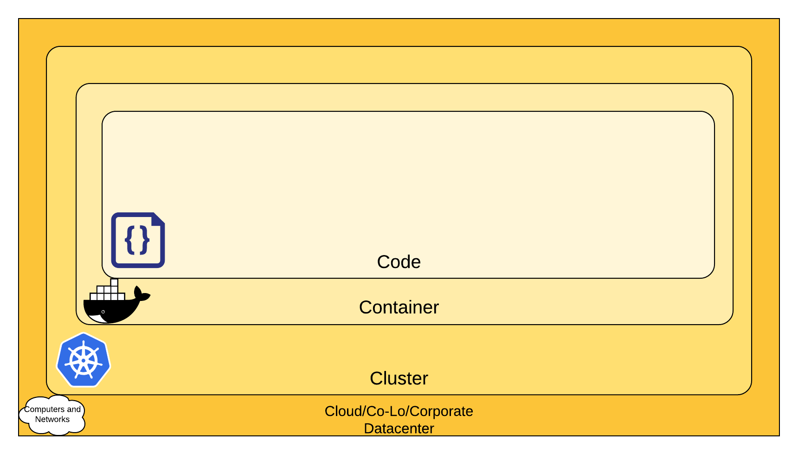

# Design and implementation of system environment for safe IoT operation

## Index

- [Result](#result)
- [Purposes](#purposes)

#### This is the Graduation project (3 people)

  > These are our thoughts at that time.
  >> “We are no longer students. We can't just look at the one-dimensional side to get into society soon. So, before we start a project, we need to choose software based on licenses, availability, cost, and know how to deploy and maintain. if possible, let's us do it ourselves."

#

## Result
  In the video, we made a mistake of joining the rest of the nodes as manager nodes, so I newly upload the picture that works well as a worker node. Also, the code may be incomplete because the source was written in JSP and then moved to Java code. (It is slightly different from the video in JSP part.)

**Ctrl+Click the Videos**
[.gif)](https://youtu.be/Ky5RnD2LzeE)

[.gif)](https://youtu.be/NIk9ZxB-kcs)

[.gif)](https://youtu.be/mGXqDwWQtnA)

**Ctrl+Click the Picture**

.png)

#

## Purposes

### 1. Security in layers

We thought about how to design the system safely. First, we set up a rough structure as shown in the picture below, and we selected the software by considering future-oriented factors.
  
    [Overview_of_Cloud_Native_Security] (<https://kubernetes.io/docs/concepts/security/overview/#the-4c-s-of-cloud-native-security>)

- Code
  - Java was chosen as the language used; Because the team member in charge of the front-end was better at Java among Python and Java.
  
- Container
  - **Docker is open-source software.** (Binaries: Freemium software as a service, Source code: Apache License 2.0)
    So we selected this.
  
- Cluster
  - When I was studying Docker, I used Docker Swarm because the site also had Docker Swarm. I found Kubernetes later and tried to move it to it, but the project was running out of time. So I used Docker Swarm as it is.

- Cloud
  - If there is time left for the project, I tried to challenge it, but I couldn't get there because we ran out of time.

#

### 2. Front-end & Back-end

- Front-end
  > We used the Vaadin framework as the front end. We chose because it has advantages such as binding of UI and data, routing from annotation, extensibility, and integration with existing platforms, etc. **It is open-source software** (Apache License 2.0).
  - It can simplify the design by using Web components.
  - It lowers the production cost by using minimal HTML, CSS, and JS code and expressing the front-end using mostly Java.
  - As a server-side based framework, it does not expose the internal state of the App to the browser. In addition, in order to prevent data forgery, data verification at the server side can be performed by supplementing the data verification at the client side.
  - One web application can be used on all platforms by using PWA (Progressive Web Application). There is no need to separately classify the existing hybrid web app or mobile app and develop. This can greatly reduce development cost and maintenance cost.

###

- Back-end
  > We used the Spring framework (Spring boot) with Tomcat built-in. The Spring Framework was chosen because of the following advantages.
  - Access control such as authentication and authorization can be easily implemented by using Spring security library.
  - Using JPA Data and Hibernate ORM, which is a JPA implementation, we can easily connect in the database and write code that manipulates DB data, in Java language.

#

### 3. CI/CD
  > The process of writing the source code, building, ["4"](#4-distribution-and-maintenance), and individual testing of the project was so slow that I tried to use it when we was done with each task. However, amount of work to do keep growing, and that doesn't happen.

  > We were going to use Jekins that have MIT License.

#

### 4. Distribution and Maintenance
  - Docker 1. Code formatter
      - autopep8, yapf, black
        There are several code formatters to make the code look pretty.
        But I choose "black" because I thought it was the best.
        I have the same opinion as the author in the link below.
        //
        Reference
          [Compare_Code_formatter] (https://www.kevinpeters.net/auto-formatters-for-python)

    2. Code checker
      - Pylint, Flake8
        I choose this because Flake8 is better at catching the error by searching several comments from the community site. 

#

#
